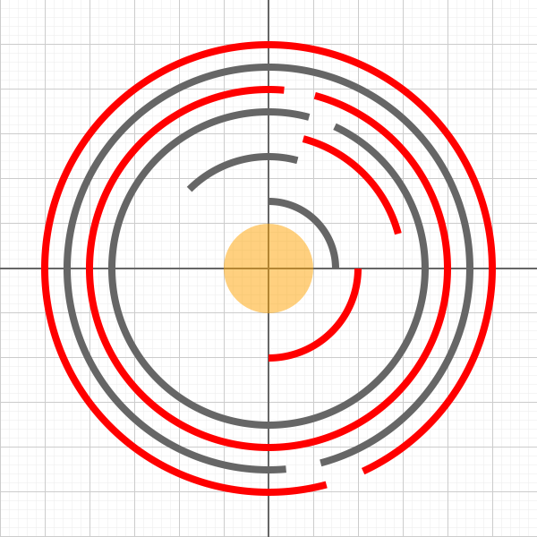

# arc-segment.ts

## Source

```ts
import { Circle, Point, ArcSegment } from '@graphics2d/entities';
import { SvgElementProperties } from '@graphics2d/generate-svg';

const grayArcData: SvgElementProperties = {
  stroke: '#666',
  strokeWidth: 8,
  fill: 'none',
};

const redArcData = { ...grayArcData, stroke: 'red' };

export const entities = [
  new Circle(Point.origin, 50).setData<SvgElementProperties>({
    fill: 'orange',
    fillOpacity: 0.5,
  }),
  new ArcSegment(Point.origin, 75, 0, 90).setData(grayArcData),
  new ArcSegment(Point.origin, 100, 0, -90).setData(redArcData),
  new ArcSegment(Point.origin, 125, 75, 60).setData(grayArcData),
  new ArcSegment(Point.origin, 150, 75, -60).setData(redArcData),
  new ArcSegment(Point.origin, 175, 75, 350).setData(grayArcData),
  new ArcSegment(Point.origin, 200, 75, -350).setData(redArcData),
  new ArcSegment(Point.origin, 225, -75, 350).setData(grayArcData),
  new ArcSegment(Point.origin, 250, -75, -350).setData(redArcData),
];

```


## Rendered to svg



