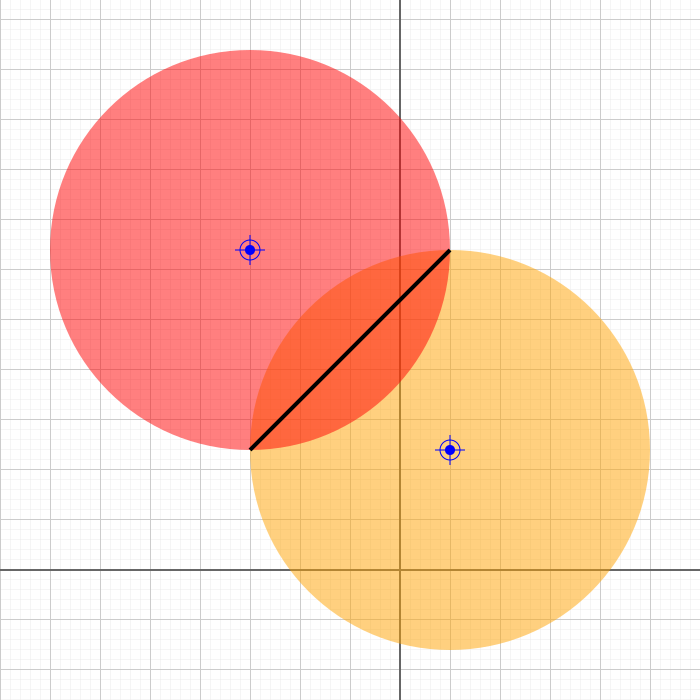

# circle-circle-intersection.ts

## Source

```ts
import { Point, Circle, LineSegment } from '@graphics2d/entities';
import { SvgElementProperties } from '@graphics2d/generate-svg';

const center1 = new Point(50, 120);
const circle1 = new Circle(center1, 200);

const center2 = new Point(-150, 320);
const circle2 = new Circle(center2, 200);

const points = circle1.intersectWithCircle(circle2);

const intersection =
  points.length === 2 ? [new LineSegment(points[0], points[1])] : points;

export const entities = [
  circle1.setData<SvgElementProperties>({ fill: 'orange', fillOpacity: 0.5 }),
  center1.setData<SvgElementProperties>({ fill: 'blue' }),
  circle2.setData<SvgElementProperties>({ fill: 'red', fillOpacity: 0.5 }),
  center2.setData<SvgElementProperties>({ fill: 'blue' }),
  ...intersection.map((e) =>
    e.setData<SvgElementProperties>({
      stroke: 'black',
      strokeWidth: 4,
      fill: 'black',
    })
  ),
];

```


## Renders to svg



