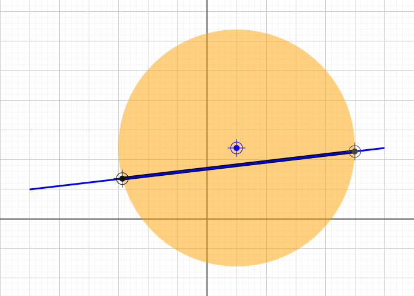

# circle-line-intersection.ts

## Source

```ts
import { SvgElementProperties } from '../../src/utilities/svg';
import { Circle, LineSegment, Point } from '../../src/entities';

const center = new Point(50, 120);
const circle = new Circle(center, 200);
const line = new LineSegment(new Point(-300, 50), new Point(300, 120));

const { points, lineSegments } = circle.intersectWithLineSegement(line);
export const entities = [
  circle.setData<SvgElementProperties>({ fill: 'orange', fillOpacity: 0.5 }),
  center.setData<SvgElementProperties>({ fill: 'blue' }),
  ...lineSegments.map((l, index) =>
    l.setData<SvgElementProperties>({ stroke: index === 1 ? 'black' : 'blue', strokeWidth: index === 1 ? 6 : 3 })
  ),
  ...points.map((p, index) => p.setData<SvgElementProperties>({ fill: `#${index * 333 + 111}` })),
];

```


## Rendered to svg



