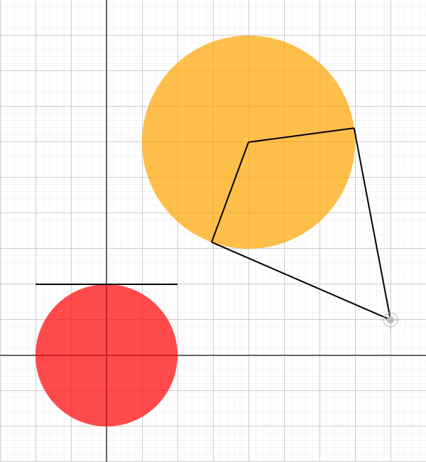

# circle-tangent.ts

## Source

```ts
import { Circle, Point, LineSegment } from '@graphics2d/entities';
import { SvgElementProperties } from '@graphics2d/generate-svg';

const circle1 = new Circle(
  new Point(200, 300),
  150
).setData<SvgElementProperties>({
  fill: 'orange',
  fillOpacity: 0.7,
});
const point = new Point(400, 50);
const lines = circle1.tangentFromPoint(point);
const radial1 = new LineSegment(circle1.center, lines[0].secondPoint);
const radial2 = new LineSegment(circle1.center, lines[1].secondPoint);

const circle2 = new Circle(Point.origin, 100).setData<SvgElementProperties>({
  fill: 'red',
  fillOpacity: 0.7,
});
const [tangent] = circle2.tangentFromPoint(new Point(0, 100));

export const entities = [
  circle1,
  ...lines,
  point,
  radial1,
  radial2,
  circle2,
  tangent,
];

```


## Renders to svg



