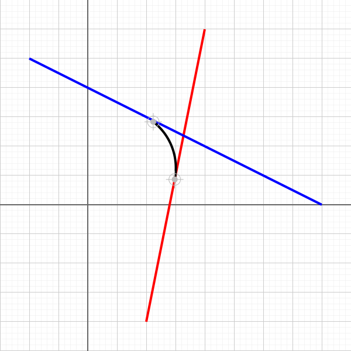

# fillet.ts

## Source

```ts
import { LineSegment, Point } from '@graphics2d/entities';
import { SvgElementProperties } from '@graphics2d/generate-svg';

const line1 = new LineSegment(
  new Point(200, 300),
  new Point(100, -200)
).setData<SvgElementProperties>({
  stroke: 'red',
  strokeWidth: 4,
});
const line2 = new LineSegment(
  new Point(-100, 250),
  new Point(400, 0)
).setData<SvgElementProperties>({
  stroke: 'blue',
  strokeWidth: 4,
});
const arc = line1.fillet(line2, 100);
if (arc !== undefined) {
  arc.setData<SvgElementProperties>({
    stroke: 'black',
    strokeWidth: 4,
    fill: 'none',
  });
}

export const entities =
  arc === undefined
    ? []
    : [line1, line2, arc, arc.startPoint(), arc.endPoint()];

```


## Renders to svg



