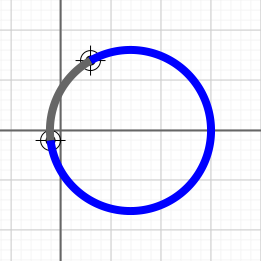

# minor-major-arc-segment.ts

## Source

```ts
import { Point, ArcSegment } from '@graphics2d/entities';
import { SvgElementProperties } from '@graphics2d/generate-svg';

const grayArcData: SvgElementProperties = {
  stroke: '#666',
  strokeWidth: 8,
  fill: 'none',
};
const blueArcData: SvgElementProperties = { ...grayArcData, stroke: 'blue' };

const point1 = new Point(30, 70).setData({ fill: `#000` });
const point2 = new Point(-10, -10).setData({ fill: `#000` });
const center = new Point(70, 0).setData({ fill: `blue` });
const { minor, major } = ArcSegment.minorMajorArc(center, point1, point2)!;

export const entities = [
  point1,
  point2.setData({ fill: `#000` }),
  minor.setData(grayArcData),
  major.setData(blueArcData),
];

```


## Renders to svg



