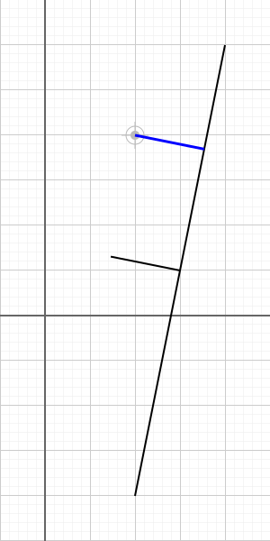

# perpendicular.ts

## Source

```ts
import { SvgElementProperties } from '../../src/utilities/svg';
import { LineSegment, Point } from '../../src/entities';

const point = new Point(100, 200);
const line = new LineSegment(new Point(200, 300), new Point(100, -200));
const perpendicularLine = line
  .createPerpendicularFrom(point)
  .setData<SvgElementProperties>({ stroke: 'blue', strokeWidth: 3 });
const movedLine = perpendicularLine
  .invert() // reverse first and second point
  .moveToPoint(line.midPoint());

export const entities = [point, line, perpendicularLine, movedLine];

```


## Rendered to svg



