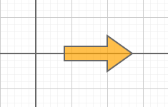

# polyline.ts

## Source

```ts
import { Point, Polyline, PolylineClosedMode } from '@graphics2d/entities';
import { SvgElementProperties } from '@graphics2d/generate-svg';

const points = [
  new Point(40, 0),
  new Point(40, 10),
  new Point(100, 10),
  new Point(100, 25),
  new Point(135, 0),
  new Point(100, -25),
  new Point(100, -10),
  new Point(40, -10),
];
const polyline = new Polyline(
  points,
  PolylineClosedMode.closed
).setData<SvgElementProperties>({
  fill: 'orange',
  fillOpacity: 0.7,
  stroke: '#666',
  strokeWidth: 2,
});
export const entities = [polyline];

```


## Renders to svg



