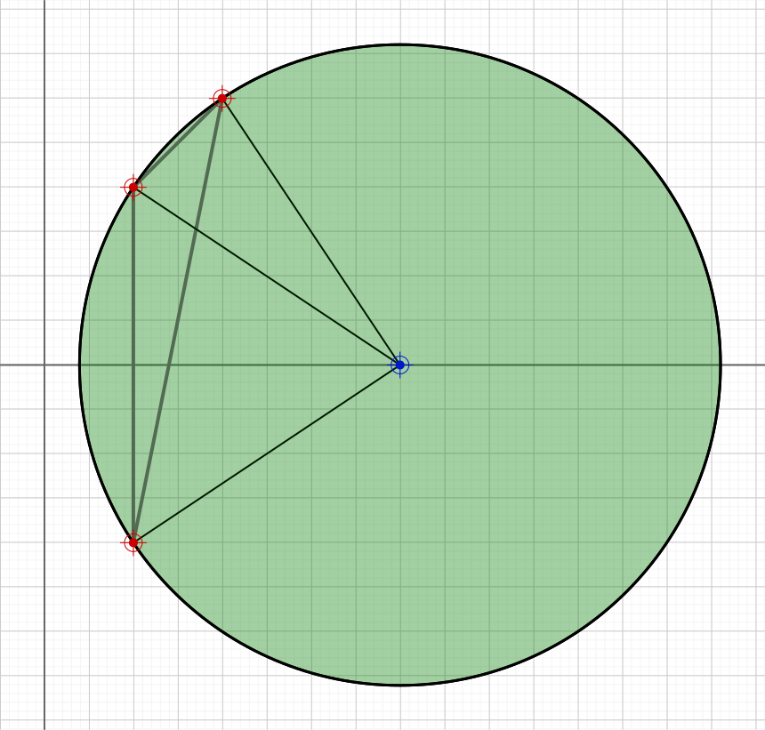

# three-point-circle.ts

## Source

```ts
import { Point, LineSegment, Circle } from '@graphics2d/entities';
import { SvgElementProperties } from '@graphics2d/generate-svg';

const points = [
  new Point(100, 200).setData<SvgElementProperties>({ fill: '#C00' }),
  new Point(200, 300).setData<SvgElementProperties>({ fill: '#C00' }),
  new Point(100, -200).setData<SvgElementProperties>({ fill: '#C00' }),
];

const lineAttributes = { strokeWidth: 4, stroke: '#666' };
const lines = [
  new LineSegment(points[0], points[1]).setData<SvgElementProperties>(
    lineAttributes
  ),
  new LineSegment(points[1], points[2]).setData<SvgElementProperties>(
    lineAttributes
  ),
  new LineSegment(points[2], points[0]).setData<SvgElementProperties>(
    lineAttributes
  ),
];

const circle = Circle.createFromThreePoints(points[0], points[1], points[2]);

const radialEntities =
  circle !== undefined
    ? [
        new LineSegment(circle!.center, points[1]),
        new LineSegment(circle!.center, points[2]),
        new LineSegment(circle!.center, points[0]),
        circle.center.setData<SvgElementProperties>({ fill: 'blue' }),
        circle?.setData<SvgElementProperties>({
          fill: 'green',
          fillOpacity: 0.2,
          stroke: 'black',
          strokeWidth: 3,
        }),
      ]
    : [];

export const entities = [circle, ...lines, ...radialEntities, ...points];

```


## Renders to svg



