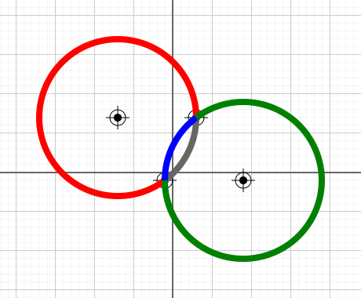

# two-point-radius-arcs.ts

## Source

```ts
import { Point, ArcSegment } from '@graphics2d/entities';
import { SvgElementProperties } from '@graphics2d/generate-svg';

const grayArcData: SvgElementProperties = {
  stroke: '#666',
  strokeWidth: 8,
  fill: 'none',
};
const elementProperties = [
  grayArcData,
  { ...grayArcData, stroke: 'red' },
  { ...grayArcData, stroke: 'blue' },
  { ...grayArcData, stroke: 'green' },
];
const point1 = new Point(30, 70);
const point2 = new Point(-10, -10);

export const entities = [
  point1.setData({ fill: `#000` }),
  point2.setData({ fill: `#000` }),
  ...ArcSegment.fromTwoPointAndRadius(point1, point2, 100).map((a, index) =>
    a.setData(elementProperties[index])
  ),
];

```


## Rendered to svg



